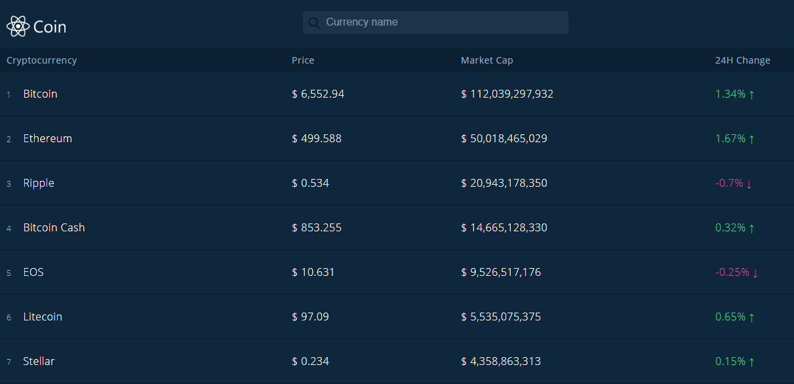
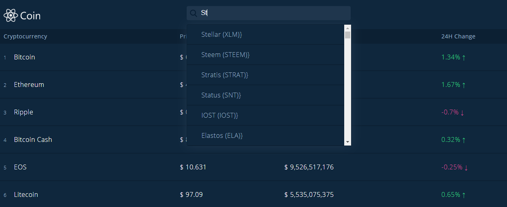

# ReactCoin

A React application that allows you to look up the latest financial information about all your favorite cryptocurrencies and see how well they are performing in the digital currency market. 

This project was bootstrapped with [Create React App](https://github.com/facebookincubator/create-react-app).

You can find the most recent version of this guide [here](https://github.com/facebookincubator/create-react-app/blob/master/packages/react-scripts/template/README.md).

## Table of contents

* [Live](#live)
* [Screenshots](#screenshots)
* [About this project](#about-this-project)
* [Getting started](#getting-started)
* [Deployment](#react-deployment)
* [Technologies used to create app](#technologies-used)
* [Direction for future development](#future)
* [Issues](#Issues)

## Live

Deployed on Heroku: <https://react-coin-data.herokuapp.com/>

Deployed on Now: <https://react-coin-vmpjkgdhtn.now.sh>

##  Screenshots

### App home page

### Currency details page

### Search autocomplete feature

##  About this project

* [How the app works](#how-app-works)
* [How the app is built](#how-the-app-is-built)

###  How the app works

When you navigate to the app home page, the app retrieves a list of currencies and the latest financial data about each currency using the [Cryptocurrencies JSON API](https://udilia.com/docs/cryptocurrencies/v1). The currencies are ordered based on market cap value. So, obviously, Bitcoin is ranked #1 because it has the highest market value. The home page displays the price, market cap, and percent changed in the last 24 hours for each currency. 

By default, the app only displays the top 20 currencies. To see more currencies, scroll down to the bottom of the page and click the right arrow to view more. Click the left arrow to go back to a previous page.

If you want to know more information about a particular currency, simply click the name of the currency in the list. The currency name is a link, which takes you to another a page in the app that has all the information about the currency you clicked, including price, rank, percent changed in the last 24 hours, market cap, 24 hour volume, and total supply.

If you are having difficulty finding a particular currency in the long list, it might be better to just use the Search box at the top of the page. The search box includes an autocomplete feature. So, you just have to start typing the first few letters of the currency you want to look up, and the app will show the currencies that match those letters. If the app can't find a result, the app will display "No results found" in the search results.

And, that's pretty much it. It's pretty simple to use, and it was fun to create. I plan to add more cool, interesting features to the app soon. See [Direction for future development](#future) to find out where this app is headed next. Stay tuned...

###  How the app is built

This project was built using React, which is an open-source Javascript library developed at Facebook specifically for the task of developing user interfaces. React relies on a component-based architecture where elements of the user interface are broken into self-contained components.

For a high level overview of React, check out this video: <https://www.youtube.com/watch?v=x7cQ3mrcKaY>.

The React documentation is available at <https://reactjs.org/>.

For more information on how this project is structured and broken into various components, see [Structure of the project](#structure-of-project).

The app also uses the Cryptocurrencies JSON API to retrieve financial data about each currency. For more information about this API, see the [Cryptocurrencies JSON API documentation](https://udilia.com/docs/cryptocurrencies/v1).

##  Getting started

The following section will take you through the steps of setting up this application and getting it running locally on your computer.

If you don't want to set up this project locally and just want to see the deployed application, go to <https://react-coin-data.herokuapp.com/>.

To set up this application locally on your computer, perform the following steps:

1. [Clone the repository](#clone-repository)

2. [Install Node.js](#install-node)

3. [Install yarn](#install-yarn)

4. [Install the dependencies](#dependencies)

5. [Start the React development server](#start-server)

###  1. Clone the repository

The first step is to clone the project repository to a local directory on your computer. To clone the repository, run the following commands:
<pre>
  git clone https://github.com/philipstubbs13/ReactCoin.git
  cd ReactCoin
</pre>

####  Structure of the project

After you clone the repository, navigate to the project root directory (ReactCoin). The project directory structure is set up as follows:

* <b>build</b>: This folder contains a build of the app optimized for production use. This folder will only appear within the project root directory if you kicked off a production build by running the <b>yarn build</b> command. If you haven't created a production build yet, then this folder will not be visible within the project root directory. For information about kicking off a production build, see [Deployment](#react-deployment).
* <b>node_modules</b>: This folder contains the project dependencies. It is ignored by git when committed to GitHub and Heroku. You install the project dependencies by running <b>yarn install</b> from the project root directory. For more information about installing dependencies for this project, go to [Install the dependencies](#dependencies).
* <b>public</b>: The public folder contains the index.html file. This HTML file is a template. The file is empty. So, if you open it directly in a browser, you will get an empty page. Rather than placing the HTML code directly in index.html, this app uses a React component-based architecture to create, build, and render UI components to the page. This folder also contains the favicon that is displayed on the browser tab.
* <b>readme_images</b>: Contains the screenshots that are used in the project README file.
* <b>src</b>: The src folder is where the React app components reside.
    * <b>components</b>: The components folder is where the React components are located and defined.
    * <b>config.js</b>: The config.js file contains the API root URL. The URL is exported so that the app can retrieve currency data using the cryptocurrency JSON API.
    * <b>helpers.js</b>: Th helpers.js file contains helper functions that are used more than once in the app. They are kept in a single file to avoid duplicating code and to have a single source, which will help with maintaining the code in the future.
    * <b>index.css</b>: The external css stylesheet for the app.
    * <b>index.js</b>: The index.js file is the top level file of the React app. In index.js, the App component is defined, the ReactDOM.render method is used to render the App component, and the routes are defined using react-router-dom.
* <b>.gitignore</b>: Anything listed inside this file (for example, node_modules) will not be tracked by GitHub or Heroku when code is committed.
* <b>package.json</b>: Lists the project dependencies and their version numbers. It also contains various scripts to start the server and get a production build of the app for deployment.
* <b>server.js</b>:This file does the following:
  * Defines and requires express.
  * Allows the app to serve static content.
  * Starts the Express server.
  * Defines the port the server is listening on.
* <b>static.json</b>: 
* <b>yarn.lock</b>: Dependency tree for the project. Lists all the dependencies and their versions.

###  2. Install Node.js

If you don't already have Node.js installed on your computer, you can install the latest version here: https://nodejs.org/en/.

###  3. Install yarn

To be able to install the dependencies and start the application locally, you will need to install yarn. Yarn is a package manager like npm.

To install yarn, run the following command:
<pre>
  npm install -g yarn
</pre>

For more information about yarn and other installation options, see the yarn documentation: <https://yarnpkg.com/en/>.

###  4. Install the dependencies

The following packages are dependencies to the project.

<ul>
  <li><b>express</b> - a Node.js web application framework (https://www.npmjs.com/package/express).</li>
  <li><b>prop-types</b> - Used to document the intended types of properties passed to components. React checks props passed to components against those definitions, and warn in development if they don’t match.(https://www.npmjs.com/package/prop-types)</li>
  <li><b>react</b> - package for accessing React (https://www.npmjs.com/package/react)</li>
  <li><b>react-dom</b> - serves as the entry point of the DOM-related rendering paths (https://www.npmjs.com/package/react-dom).</li>
  <li><b>react-scripts</b>: package that includes scripts and configuration used by Create React App. (https://www.npmjs.com/package/react-scripts)</li>
  <li><b>serve</b> - packaged used to serve a static single page app. It also provides an interface for listing the directory's contents (https://www.npmjs.com/package/serve).</li>
</ul>

Version information for each of these packages is available in the <b>package.json</b> file in the project root directory.

After you clone the repository to a local directory, change directory to the project root directory and run the following command to install the required packages:

<pre>yarn install</pre>

### <a name="start-server"> 5. Start the React development server.</a>

After performing all of the setup steps in the <b>Getting started</b> section, navigate to the project root directory (ReactCoin) and run the following command to start the React development server:

<pre>
yarn start
</pre>

After the development server has started, a Chrome browser window should open, and you should see the application. If the browser does not automatically open after the server starts, you can verify that the application is working locally on your computer by manually opening Chrome and going to <a href="http://localhost:9000">http://localhost:9000</a>.

<b>Troubleshooting tip</b>: If you are still unable to see the application in the browser at <a href="http://localhost:3000">http://localhost:9000</a>, ensure that no other applications/processes are using port 9000. If port 9000 is in use by another process, kill that process and then restart the server.

##  Deployment

This app is deployed to Heroku. To deploy the app, you will need to build a production version of the app as well as have Heroku CLI installed.

1. Download and install the Heroku CLI. You can install the Heroku CLI <a href="https://devcenter.heroku.com/articles/heroku-cli">here</a>.

2. If you haven't already, log in to your Heroku account and follow the prompts to create a new SSH public key.
<pre>heroku login</pre>

3. Change directory to the project root directory (<b>ReactCoin</b>).

4. If you have deployed the app before, delete the <b>ReactCoin/build</b> folder.

5. Run the following command to build a clean, production version of the app.
<pre>yarn build</pre>

This command creates a folder called <b>build</b> inside the project root directory 

6. Deploy your changes
<pre>
git add .
git commit -am "heroku commit message"
git push heroku master
</pre>

If you run into any issues with deploying the app to Heroku, run the following command in the project root directory to see the Heroku logs.

<pre>heroku logs</pre>

For more information on deploying an app to Heroku, refer to the [Heroku documentation](https://www.heroku.com/).

This app is also deployed to Now. For information on deploying a static React app to Now, refer to the [Now documentation](https://zeit.co/).

##  Technologies used to build app

* HTML
* CSS
* Javascript
* React (<https://reactjs.org/>)
* Node.js (<https://nodejs.org/en/>)
* Cryptocurrencies JSON API (<https://udilia.com/docs/cryptocurrencies/v1>)

##  Direction for future development
Source code will be developed over time to handle bug fixes and new features.

The following is a list of potential enhancements for future code development.

* Add feature that allows users to favorite specific currencies.

* Add another page to the app that allows users to see curriences they favorited.

* Add feature that allows users to enter notes about currencies they favorited.

* Update css/styling of app.

* Add ESLint to help clean up code.

* Add user authentication.

##  Issues

If you find an issue while using the app or have a request, <a href="https://github.com/philipstubbs13/ReactCoin/issues/" target="_blank">log the issue or request here</a>. These issues will be addressed in a future code update.
